# Manual de Validación — Grafana UI

> AI for Developers | 30X · Clase 11 — Observabilidad
> Validado el 2026-09-28 con Grafana 12.2, Tempo 2.7, Prometheus 3.4, Loki 3.5 y OpenTelemetry Collector 0.127, con la app **EntreVista AI** (`../requirement-hr-ia`) instrumentada y en ejecución.

Este documento describe paso a paso cómo validar, desde la interfaz de Grafana, que el stack de observabilidad recibe y correlaciona las tres señales de la aplicación: **trazas** (Tempo), **métricas** (Prometheus) y **logs** (Loki). Cada sección tiene una captura real del resultado esperado y un criterio de aceptación.

---

## Tabla de contenido

1. [Prerrequisitos](#1-prerrequisitos)
2. [Acceso a Grafana](#2-acceso-a-grafana)
3. [Verificar datasources](#3-verificar-datasources)
4. [Dashboards provisionados](#4-dashboards-provisionados)
5. [Validación de métricas (Prometheus)](#5-validación-de-métricas-prometheus)
6. [Validación de trazas (Tempo)](#6-validación-de-trazas-tempo)
7. [Validación de logs (Loki)](#7-validación-de-logs-loki)
8. [Correlación entre señales](#8-correlación-entre-señales)
9. [Checklist de validación](#9-checklist-de-validación)
10. [Problemas comunes](#10-problemas-comunes)

---

## 1. Prerrequisitos

La validación completa necesita telemetría **real** de la aplicación, no solo la del script de prueba. Antes de abrir Grafana:

> **Atajo:** `../requirement-hr-ia/scripts/demo-up.sh` ejecuta los pasos 1.1 y 1.2 completos, deja una campaña activa y arranca el bot de Telegram si `.env.local` trae su token. Solo queda generar tráfico (1.3), con el simulador o escribiéndole al bot desde el enlace de la campaña.

### 1.1 Stack de observabilidad

```bash
# Desde otel-stack/
docker compose up -d
docker compose ps        # otel-collector, tempo, prometheus, loki y grafana en estado "Up"
./scripts/test-telemetry.sh   # ✓ en trace, métrica y log
```

### 1.2 Aplicación instrumentada

```bash
# 1. LocalStack en localhost:4566 (por ejemplo, el docker-compose de estacion9/repos/iac-infra)
# 2. Tablas y secretos de la app
cd ../requirement-hr-ia && ./scripts/localstack-init.sh

# 3. Webapp con su .env.local (OPENAI_API_KEY real, NEXT_PUBLIC_DEV_MODE=true; cómo obtener la llave: README de la app, "Llaves necesarias")
cd webapp && cp .env.example .env.local && npm install && npm run dev
```

La consola debe mostrar `[OTel] Instrumentation started — service: hr-ia-webapp, collector: http://localhost:4318` y `GET /api/health` debe responder `{"status":"healthy", ...}`.

### 1.3 Generar tráfico con IA

1. Entra a `http://localhost:3000/login` con `test` / `test`.
2. **Campañas → Nueva Campaña**: llena nombre, descripción del rol y elige la rúbrica **BPO**. Crear.
3. En el detalle de la campaña, pulsa **Activar campaña**. Solo las campañas activas aceptan candidatos.

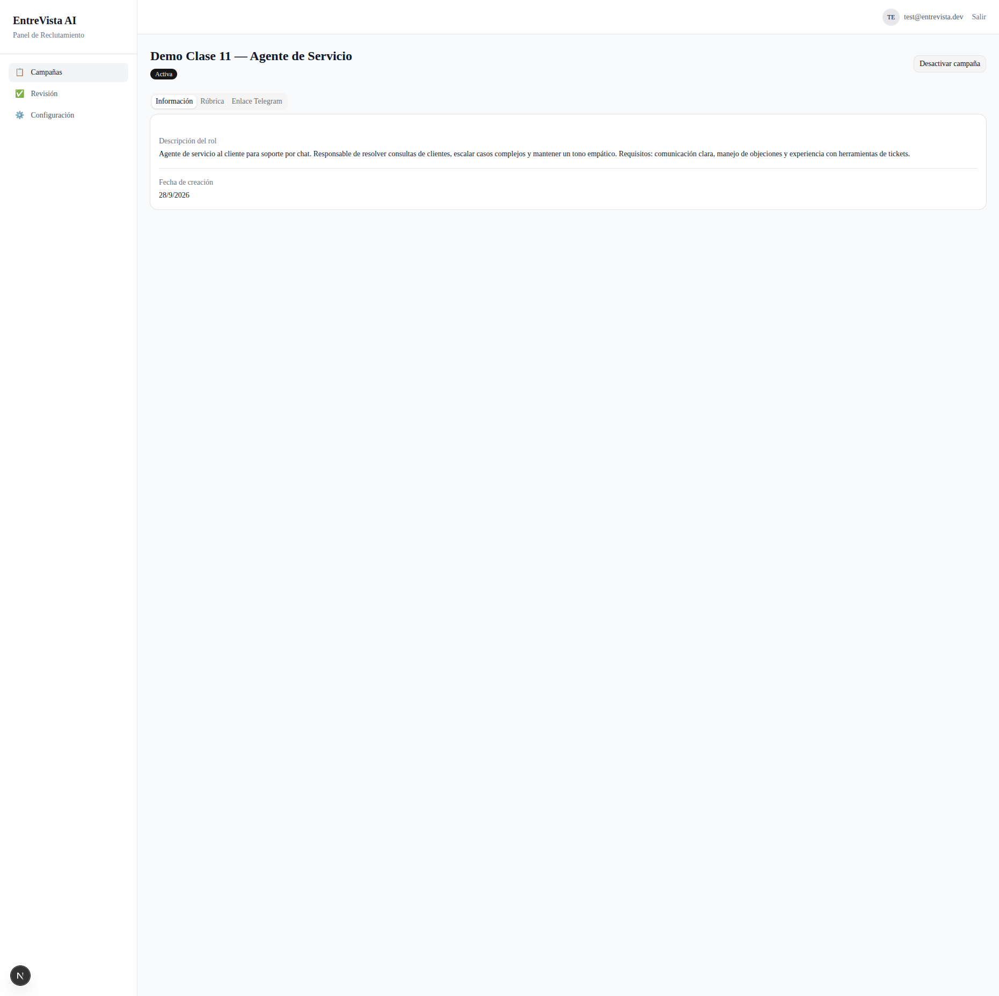

4. Simula un candidato (el `campaignId` está en la URL del detalle):

```bash
# Inicia la entrevista: la primera llamada al LLM
curl -s -X POST http://localhost:3000/api/simulator -H 'Content-Type: application/json' \
  -d '{"action":"start","campaignId":"<CAMPAIGN_ID>","simulatedUserId":"demo-1"}'

# Responde como candidato las veces que quieras (cada mensaje = una llamada al LLM)
curl -s -X POST http://localhost:3000/api/simulator -H 'Content-Type: application/json' \
  -d '{"action":"message","conversationId":"<CONVERSATION_ID>","message":"Sí, acepto continuar."}'
```

Con 3 o 4 mensajes ya hay suficiente telemetría. Una entrevista completa (unas 10 respuestas) termina en `"state":"completed"` y dispara además la **evaluación**, que es la segunda operación del LLM.

---

## 2. Acceso a Grafana

Abre `http://localhost:3001`. Sin iniciar sesión eres **Viewer anónimo**: puedes ver los dashboards pero no **Explore**. Para la validación completa inicia sesión:

1. **Sign in** (esquina superior derecha) → `admin` / `admin`.
2. Grafana pide cambiar la contraseña por defecto: pulsa **Skip** (es un entorno local).

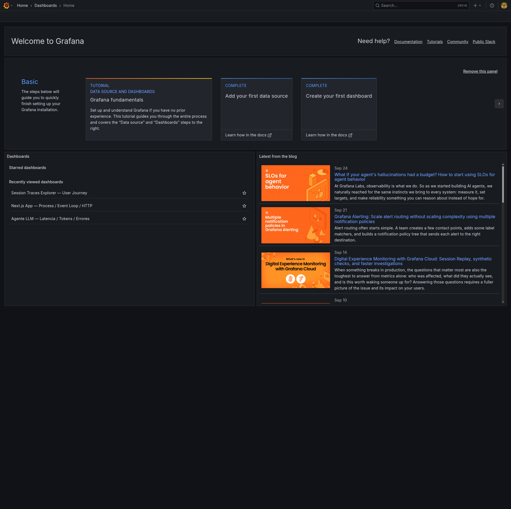

**Criterio de aceptación:** la pantalla de inicio carga sin errores en la consola del navegador y el menú lateral muestra **Dashboards** y **Explore**.

---

## 3. Verificar datasources

Menú lateral → **Connections** → **Data sources**.

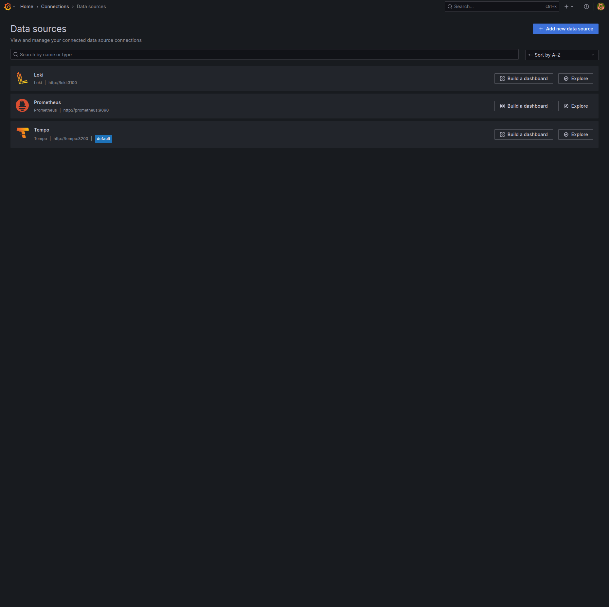

**Criterio de aceptación:**

| Datasource | URL interna | Rol |
|------------|-------------|-----|
| **Tempo** (default) | `http://tempo:3200` | Trazas. Configurado para saltar a Loki y a Prometheus desde un span |
| **Prometheus** | `http://prometheus:9090` | Métricas |
| **Loki** | `http://loki:3100` | Logs. El campo `trace_id` de cada log enlaza a Tempo |

Abre cada uno, baja hasta el final y pulsa **Test**: los tres deben responder *Data source is working*. Vienen de `grafana/provisioning/datasources/datasources.yaml`; no hay que configurar nada a mano.

---

## 4. Dashboards provisionados

Menú lateral → **Dashboards**.

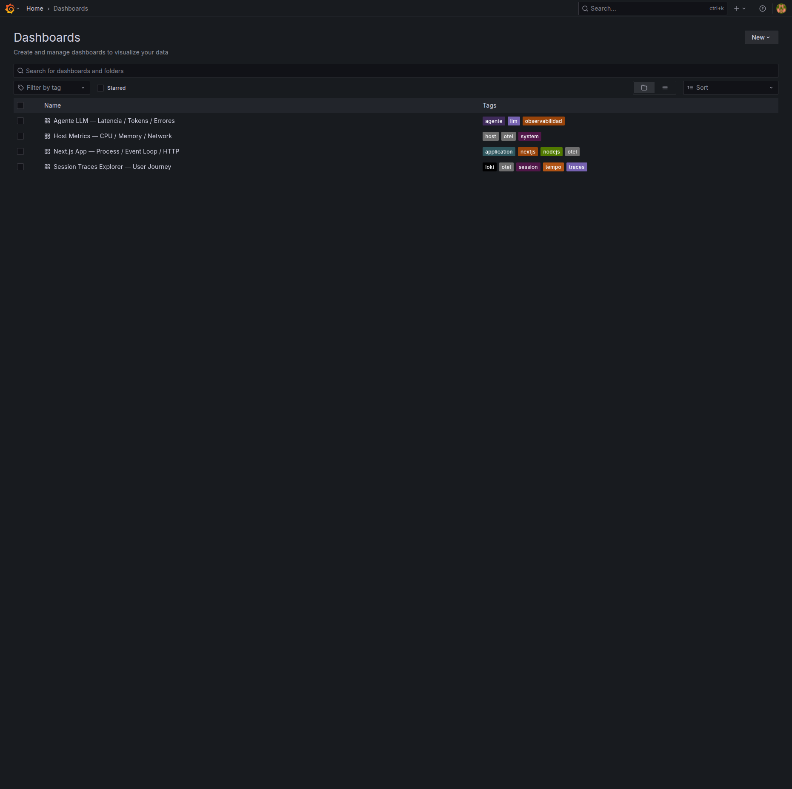

**Criterio de aceptación:** aparecen los cuatro dashboards sin haber importado nada:

| Dashboard | Fuente |
|-----------|--------|
| Agente LLM — Latencia / Tokens / Errores | `../requirement-hr-ia/grafana-dashboards/llm-agent.json` |
| Host Metrics — CPU / Memory / Network | `host-metrics.json` |
| Next.js App — Process / Event Loop / HTTP | `nextjs-app-metrics.json` |
| Session Traces Explorer — User Journey | `traces-explorer.json` |

Son **código**: viven junto a la app y `docker-compose.yml` monta la carpeta en Grafana (`DASHBOARDS_DIR`). Si editas un JSON, Grafana lo recarga en 10 segundos.

---

## 5. Validación de métricas (Prometheus)

### 5.1 Dashboard Agente LLM

Abre **Agente LLM** con rango *Last 1 hour*. Es el dashboard que responde las preguntas que un HTTP 200 no responde: cuánto tarda el modelo, cuántos tokens consume y cuándo falla.

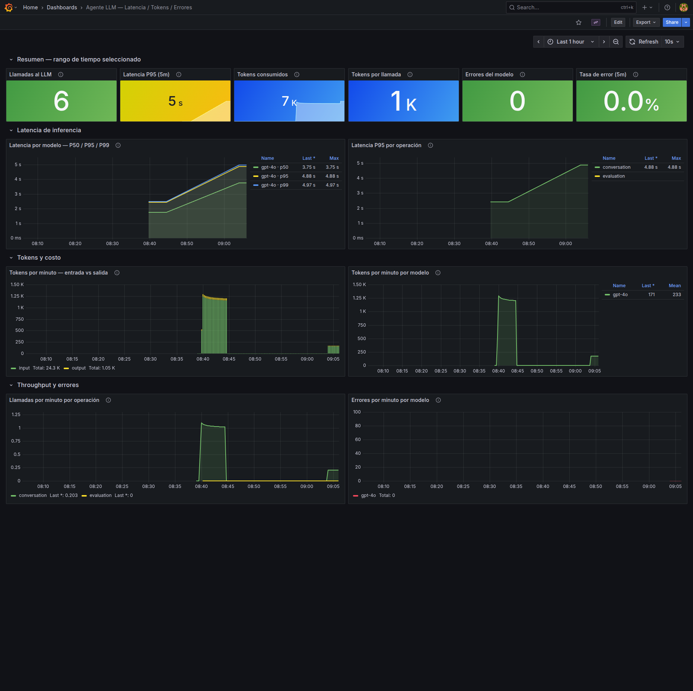

**Criterio de aceptación** (después de una entrevista simulada):

- **Llamadas al LLM** > 0 y **Errores del modelo** = 0 (el panel muestra `0`, no *No data*: la app inicializa los counters al arrancar).
- **Latencia P95** entre 1 y 10 s: un LLM tarda segundos, no milisegundos.
- **Latencia por modelo** muestra `gpt-4o · p50/p95/p99`; **por operación** distingue `conversation` y `evaluation`.
- **Tokens por minuto**: la serie `input` domina a `output` (el prompt y el contexto pesan más que la respuesta).

### 5.2 Dashboards de plataforma

**Next.js App** cubre heap, RSS, CPU, event loop y HTTP. El panel **Requests por minuto por ruta** usa las span metrics que Tempo genera desde los spans del router (`POST /api/simulator`, `GET /campaigns`, …).

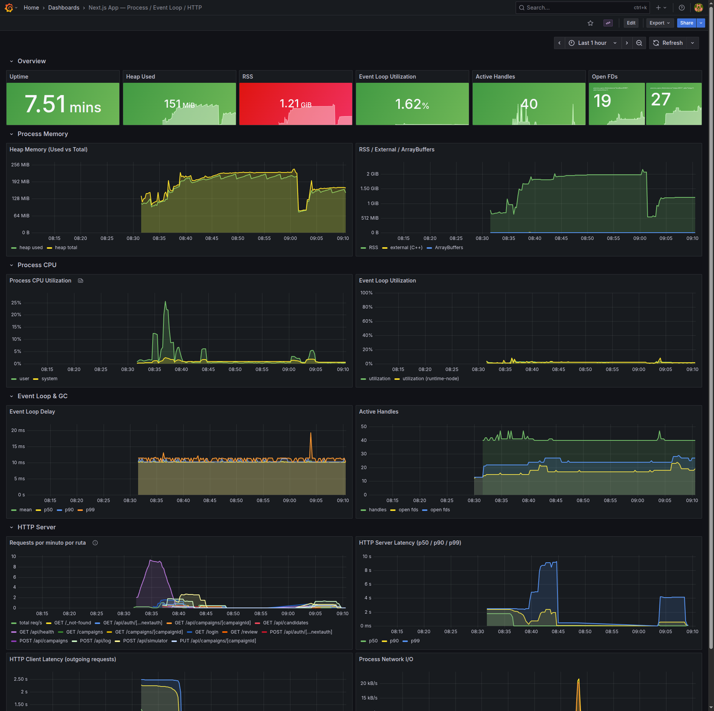

**Host Metrics** cubre CPU, memoria y red de la máquina donde corre la app.

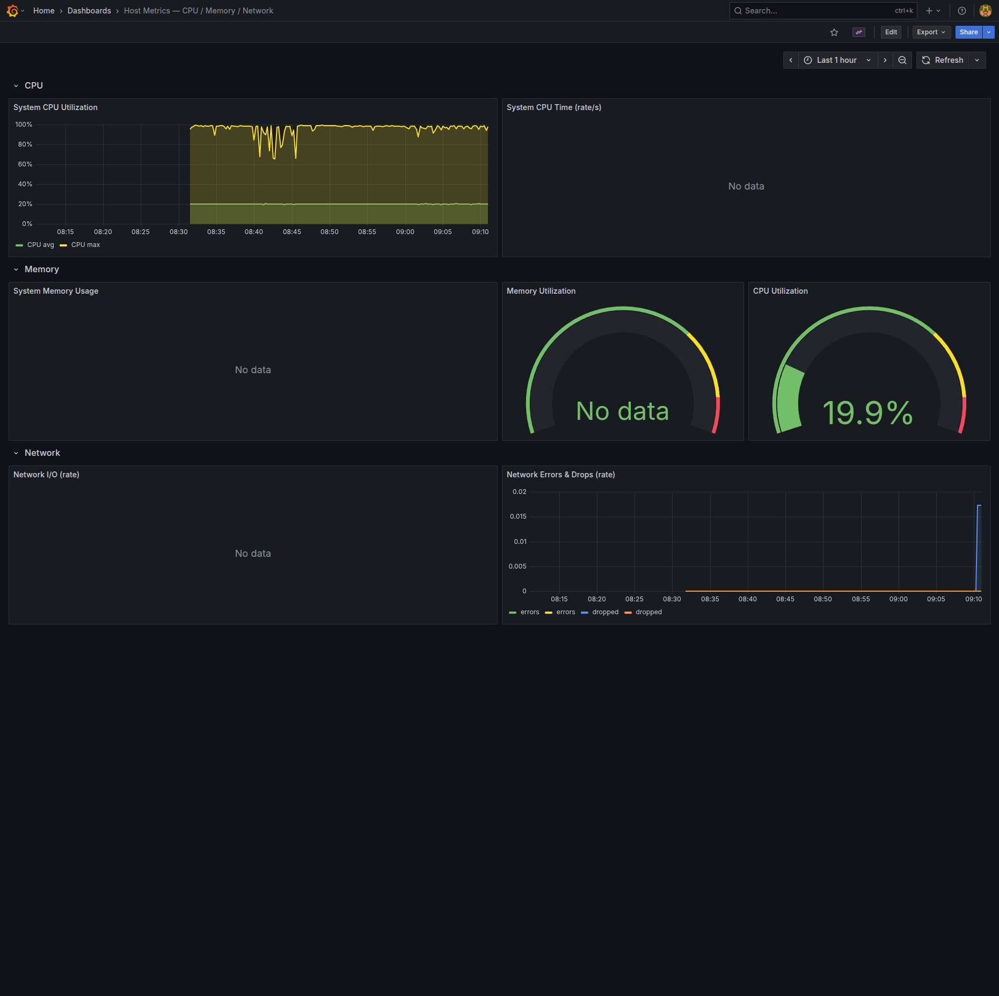

**Criterio de aceptación:** ningún panel muestra *No data* con la app corriendo. **Uptime** coincide con el tiempo desde `npm run dev`.

### 5.3 Explore → Prometheus

Menú **Explore**, datasource **Prometheus**, modo **Code**:

```promql
sum by (llm_operation) (llm_request_duration_milliseconds_count)
```

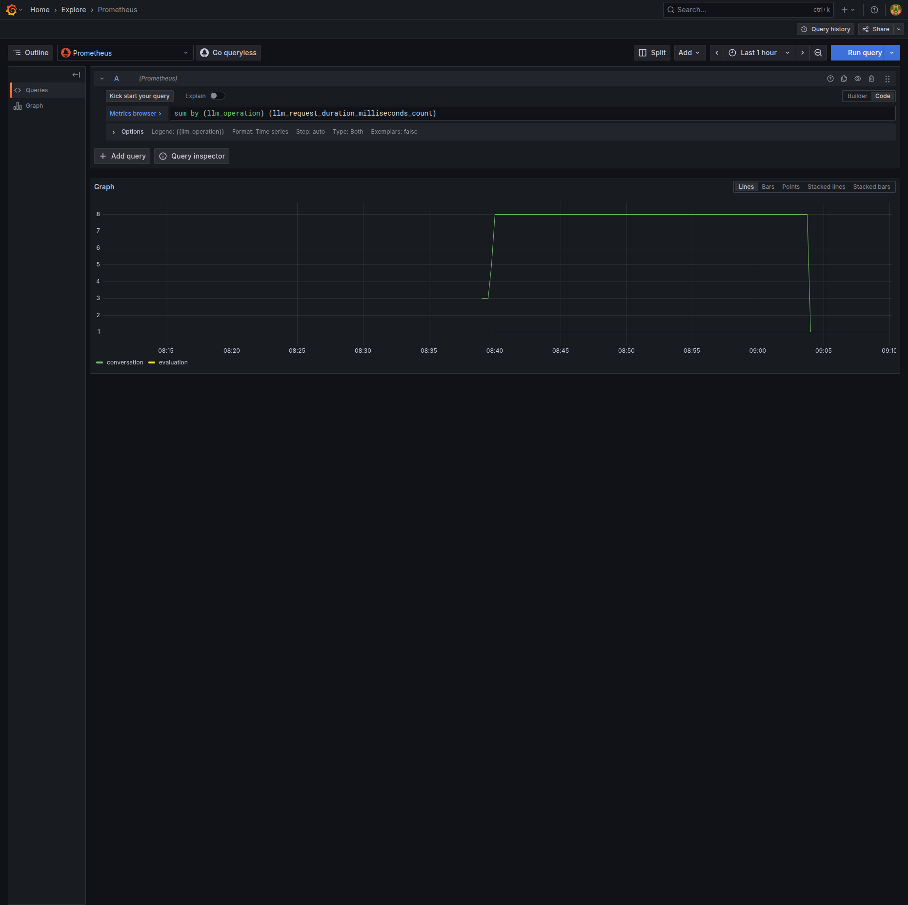

**Criterio de aceptación:** una serie por operación (`conversation`, `evaluation`) con valores crecientes. Si la app se reinició verás el contador caer a 0 y volver a subir: Prometheus lo interpreta como *counter reset* y las funciones `rate`/`increase` lo compensan.

Otras queries útiles:

| Query | Qué valida |
|-------|------------|
| `up` | Los tres targets (`prometheus`, `otel-collector`, `tempo`) en `1` |
| `llm_tokens_total` | Tokens por `llm_model`, `llm_operation` y `llm_token_type` |
| `histogram_quantile(0.95, sum by (le) (rate(llm_request_duration_milliseconds_bucket[5m])))` | P95 de inferencia |
| `http_server_duration_milliseconds_count` | Requests HTTP entrantes (auto-instrumentación) |
| `traces_spanmetrics_calls_total{service="hr-ia-webapp"}` | RED metrics generadas por Tempo desde las trazas |
| `otelcol_receiver_accepted_spans_total` | Spans que el Collector ha recibido |
| `otelcol_exporter_send_failed_spans_total` | Debe ser 0: nada se pierde entre Collector y Tempo |

> Los nombres cambian entre el código y Prometheus: `llm.request.duration` (unidad `ms`) llega como `llm_request_duration_milliseconds_*`, y los atributos `llm.model` se vuelven labels `llm_model`.

---

## 6. Validación de trazas (Tempo)

### 6.1 Dashboard Session Traces Explorer

Abre **Session Traces Explorer**. Los paneles son tablas de búsqueda TraceQL: cada fila es una traza y el **Trace ID** enlaza al detalle.

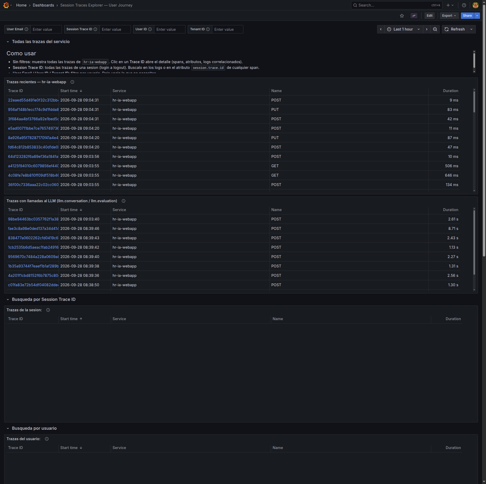

**Criterio de aceptación:**

- **Trazas recientes** lista requests de `hr-ia-webapp` (`GET`, `POST`, `PUT`) con duración.
- **Trazas con llamadas al LLM** lista solo las que contienen un span `llm.*`, con duraciones de segundos.
- Las variables **Session Trace ID** y **User Email** filtran las tablas de abajo (llénalas con un valor de los logs).

### 6.2 Explore → Tempo con TraceQL

Menú **Explore**, datasource **Tempo**, pestaña **TraceQL**:

```traceql
{ resource.service.name = "hr-ia-webapp" && name =~ "llm\\..*" }
```

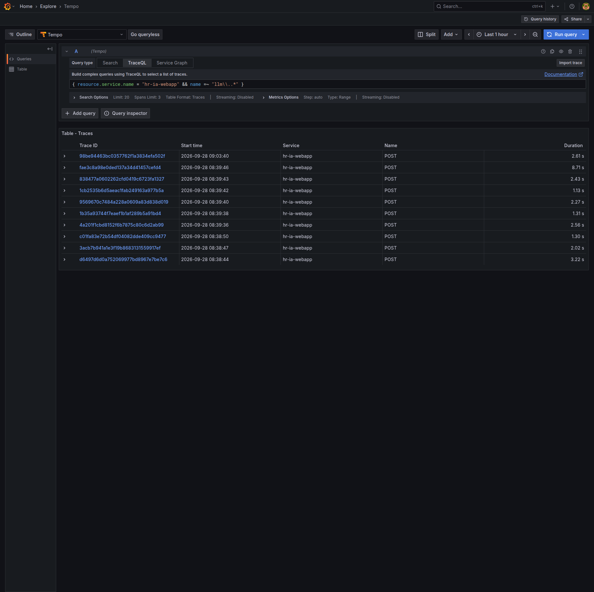

**Criterio de aceptación:** la tabla muestra trazas de `hr-ia-webapp` cuyo nombre raíz es `POST` (la request a `/api/simulator` o al webhook de Telegram) con duración de 1 a 10 s.

### 6.3 Detalle de una traza

Haz clic en cualquier **Trace ID**.

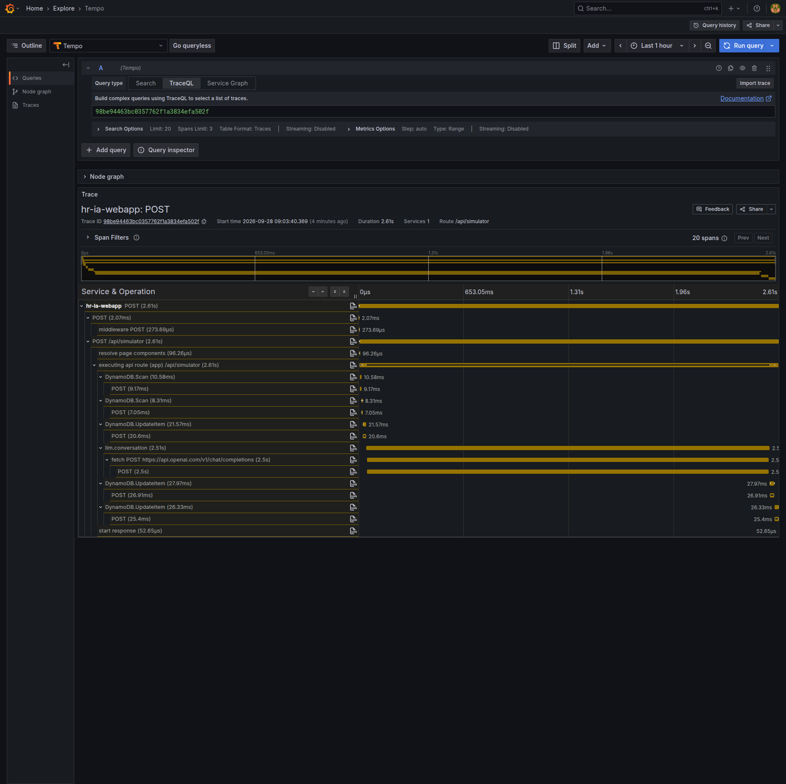

**Criterio de aceptación:** la cascada de spans cuenta la historia completa de una request:

1. `POST /api/simulator` → `executing api route` (Next.js, auto-instrumentado).
2. `DynamoDB.Scan` y `DynamoDB.UpdateItem` con `db.system=dynamodb` y el nombre de la tabla (instrumentación del AWS SDK).
3. **`llm.conversation`** (span manual) con los atributos `llm.model`, `llm.tokens.input`, `llm.tokens.output`, `llm.latency_ms`, `llm.phase`. Haz clic en el span para verlos.
4. Dentro, `fetch POST https://api.openai.com/v1/chat/completions`: la llamada real al modelo y casi toda la duración de la traza.

Junto a cada span hay un ícono de **logs**: abre los logs de Loki de esa traza (ver sección 8).

### 6.4 Buscar por Trace ID

En la misma pestaña **TraceQL**, pega un Trace ID (32 caracteres hexadecimales) y ejecuta. Es lo que hace el enlace *Ver trace en Tempo* de los logs.

---

## 7. Validación de logs (Loki)

Los logs llegan a Loki por el endpoint OTLP nativo. Los atributos de recurso se vuelven **labels** (`service_name`, `deployment_environment`) y el resto, incluidos `trace_id`, `span_id` y los campos `context_*` del logger, **structured metadata**: se filtran con `| campo="valor"` sin parsear JSON.

### 7.1 Consultar logs

Menú **Explore**, datasource **Loki**, modo **Code**:

```logql
{service_name="hr-ia-webapp"} | log_service="openai"
```

Pulsa el botón **See log details** (▸) de una línea.

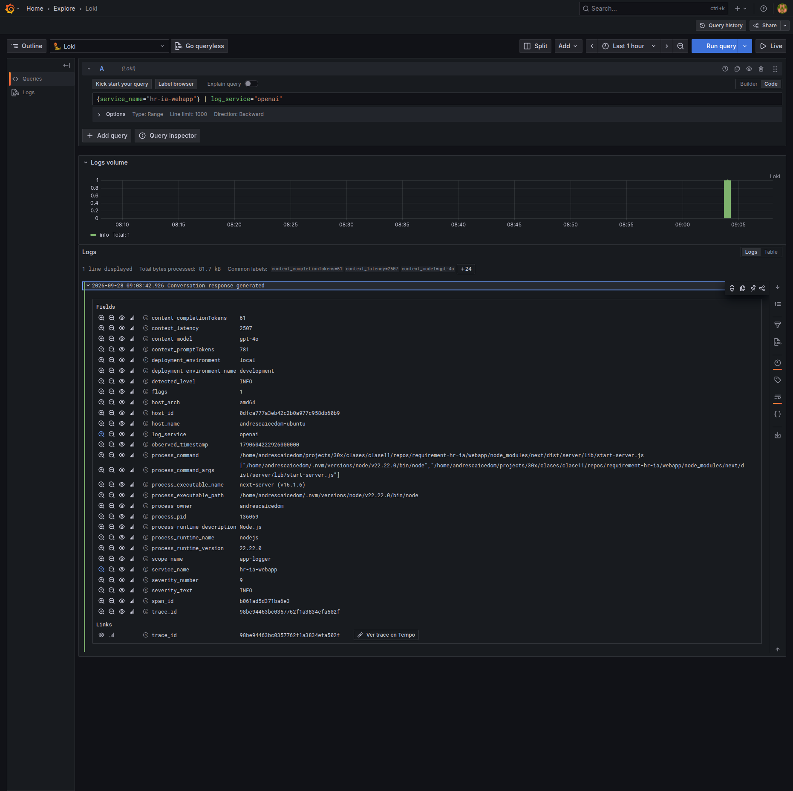

**Criterio de aceptación:**

- El mensaje es `Conversation response generated` (o `Evaluator response generated`).
- Entre los campos aparecen `context_model`, `context_latency`, `context_promptTokens`, `context_completionTokens`.
- `trace_id` y `span_id` tienen valores hexadecimales, y en **Links** el campo `trace_id` muestra el botón **Ver trace en Tempo**.

Otras queries útiles:

| Query | Qué muestra |
|-------|-------------|
| `{service_name="hr-ia-webapp"}` | Todos los logs de la app |
| `{service_name="hr-ia-webapp"} \| trace_id="<TRACE_ID>"` | Los logs de una traza concreta |
| `{service_name="hr-ia-webapp"} \| log_service=~"login-page\|sidebar\|auth"` | Recorrido del usuario en la interfaz |
| `{service_name="hr-ia-webapp"} \|= "st-"` | Logs con `sessionTraceId` (correlación por sesión) |
| `{service_name="test-service"}` | El log del script `test-telemetry.sh` |

---

## 8. Correlación entre señales

La ventaja del stack es pasar de una señal a otra sin copiar IDs a mano. Todo se apoya en el `trace_id`.

### De log a traza

En el detalle de un log (sección 7.1), pulsa **Ver trace en Tempo**. Grafana abre una vista dividida: el log a la izquierda y la traza completa a la derecha.

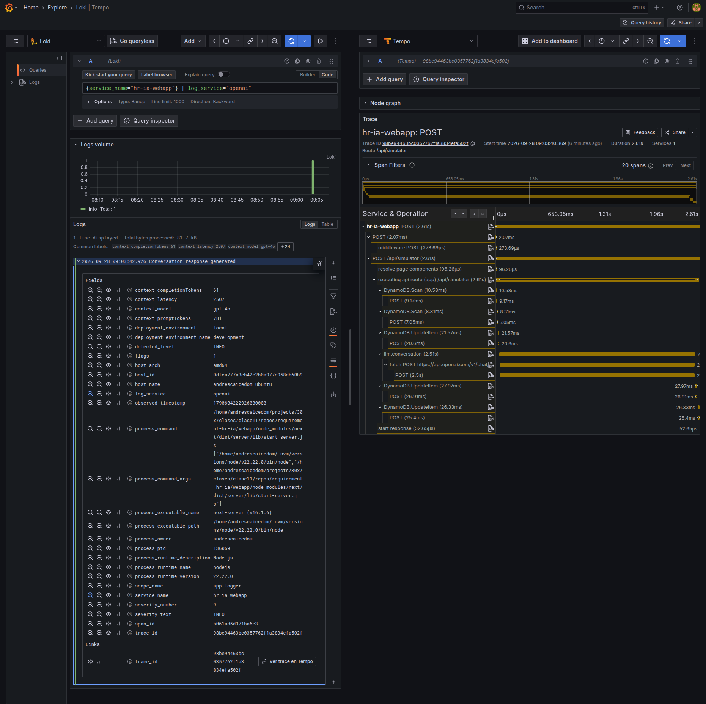

**Criterio de aceptación:** el Trace ID del panel derecho coincide con el campo `trace_id` del log, y la traza contiene el span `llm.conversation` que generó ese log.

### De traza a logs

En el detalle de una traza, pulsa el ícono de **logs** junto a un span. Grafana abre Loki filtrando por ese `trace_id` (configuración `tracesToLogsV2` del datasource Tempo).

### De traza a métricas

En el detalle de una traza, el botón **Metrics** (si aparece) salta a Prometheus con las span metrics de ese servicio (`tracesToMetrics`).

> La correlación se define en `grafana/provisioning/datasources/datasources.yaml`: `derivedFields` (Loki → Tempo, por el campo `trace_id`) y `tracesToLogsV2` (Tempo → Loki).

---

## 9. Checklist de validación

| # | Verificación | Dónde | Resultado esperado |
|---|--------------|-------|--------------------|
| 1 | Cinco contenedores `Up` | `docker compose ps` | otel-collector, tempo, prometheus, loki, grafana |
| 2 | Script de prueba | `./scripts/test-telemetry.sh` | ✓ trace, ✓ métrica, ✓ log |
| 3 | App instrumentada | consola de `npm run dev` | `[OTel] Instrumentation started` |
| 4 | Health de la app | `curl localhost:3000/api/health` | `"status":"healthy"` |
| 5 | Targets de Prometheus | Explore → `up` | `prometheus`, `otel-collector`, `tempo` = 1 |
| 6 | Datasources | Connections → Data sources → Test | *Data source is working* ×3 |
| 7 | Dashboards | Dashboards | Los cuatro, sin importar |
| 8 | Métricas del LLM | Dashboard Agente LLM | Llamadas > 0, P95 en segundos, errores = 0 |
| 9 | Trazas | Session Traces Explorer | Filas con Trace ID clicable |
| 10 | Spans de negocio | Detalle de traza | `llm.conversation` con `llm.tokens.*`, `DynamoDB.*` con nombre de tabla |
| 11 | Logs | Explore → Loki | `trace_id` y `span_id` como campos |
| 12 | Correlación | Ver trace en Tempo | Vista dividida log \| traza con el mismo ID |

---

## 10. Problemas comunes

| Síntoma | Causa probable | Solución |
|---------|----------------|----------|
| Dashboards en *No data* | La app no está corriendo o el rango de tiempo no cubre el tráfico | Arranca la app, genera tráfico (1.3) y usa *Last 1 hour* |
| `/api/health` responde 503 | LocalStack apagado o `DYNAMODB_ENDPOINT` incorrecto en `.env.local` | LocalStack en `:4566` y `./scripts/localstack-init.sh` |
| El login solo muestra *SSO* | Falta `NEXT_PUBLIC_DEV_MODE=true` en `.env.local` | Añádelo y reinicia `npm run dev` (las variables `NEXT_PUBLIC_*` se fijan al arrancar) |
| `/api/simulator` responde 400 *must be "active"* | La campaña está en Borrador | Pulsa **Activar campaña** en su detalle |
| Target `otel-collector` en `down` | El Collector no expone `:8888` | Revisa `service.telemetry.metrics.readers` en `otel-collector-config.yaml` y `docker restart otel-collector` |
| Logs no aparecen en Loki | Exporter incorrecto o Loki sin structured metadata | `otlphttp/loki` → `http://loki:3100/otlp` y `allow_structured_metadata: true` |
| Cambié un YAML y no pasa nada | Los bind mounts no recrean el contenedor | `docker compose restart <servicio>` |
| Sin **Explore** en el menú | Sesión anónima (Viewer) | Inicia sesión como `admin` |
| El bot de Telegram no responde | El bot es un proceso aparte (long polling) y no está corriendo, o se escribió sin abrir el enlace de la campaña | `npm run telegram` en `webapp/` (o `demo-up.sh`) y entra por `https://t.me/<bot>?start=<campaignId>` |
| Las conversaciones de Telegram no salen en Grafana | El proceso del bot arrancó sin OpenTelemetry | Debe verse `[OTel] Instrumentation started … instance: telegram-bot` en su log; filtra con `instance="telegram-bot"` |
| El link *Ver trace en Tempo* no aparece | El log no trae `trace_id` (se emitió fuera de un span) | Es normal en logs de arranque; usa un log de `log_service="openai"` |
