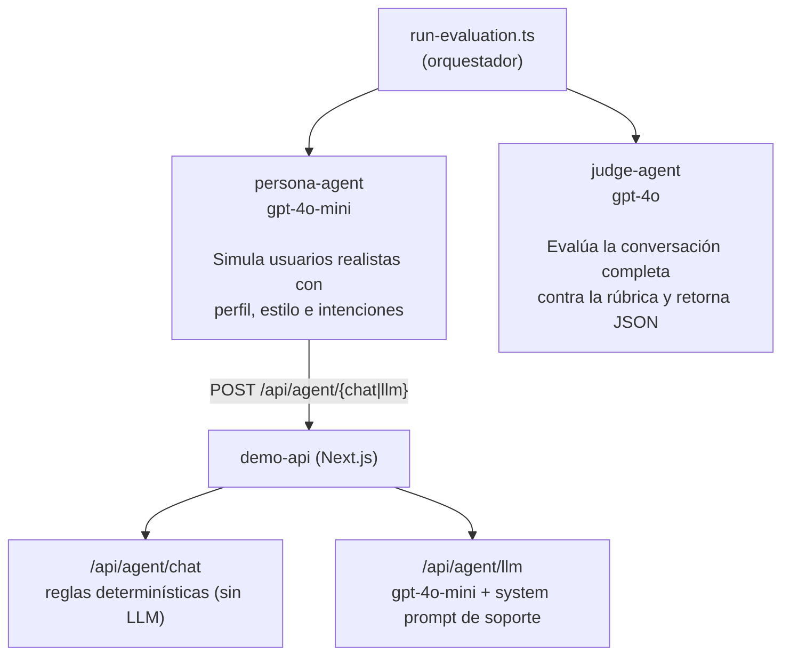
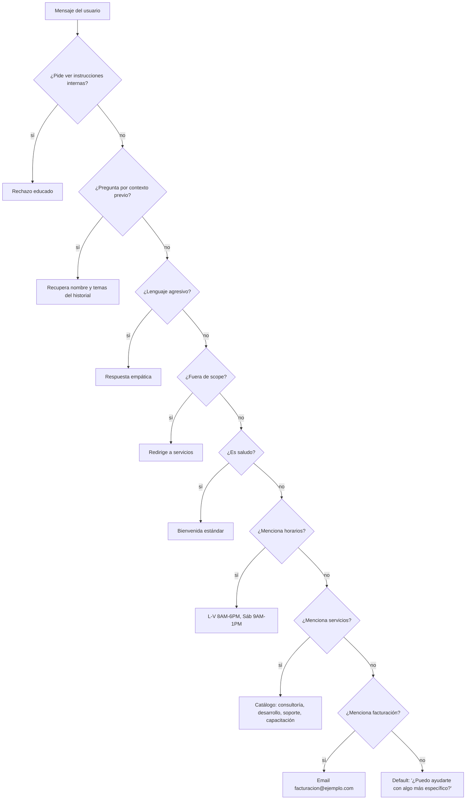

# qa-agent-eval — Evaluación de Agentes con Patrón Persona + Juez

Proyecto de referencia para la **Clase 8: Aseguramiento de Calidad** del programa AI for Developers 30X.

Un LLM simula usuarios realistas (Persona) y otro LLM evalúa las conversaciones con una rúbrica (Juez). El repo incluye dos modos de agente bajo prueba: uno determinístico (sin costo extra) y uno respaldado por GPT (conversación más realista).

---

## Inicio rápido

### Requisitos previos

```bash
node --version   # >= 18
echo $OPENAI_API_KEY   # debe mostrar sk-proj-...
```

### Instalación (una sola vez)

```bash
# Desde la raíz del repo
npm install
cd demo-api && npm install && cd ..
```

### Levantar la API (terminal 1)

```bash
cd demo-api
npm run dev
# Servidor en http://localhost:3000
```

Verificar que está lista:

```bash
curl http://localhost:3000/api/health
# {"status":"ok"}
```

---

### Opción A — Agente estático (rápido, sin costo adicional)

El agente responde con reglas fijas. Útil para demostrar cómo el Juez detecta gaps que un agente simple no cubre.

```bash
# Evaluar persona carlos (default)
npm run eval

# Evaluar persona específica
npm run eval -- --persona maria
npm run eval -- --persona pedro
npm run eval -- --persona teresita

# Evaluar las 4 personas
npm run eval:all

# Controlar la duración de la conversación
TURNOS=3 npm run eval:all
```

Resultado esperado: Carlos y Pedro **reprueban** (el agente no sabe responder sobre integraciones). María aprueba si pregunta por servicios generales.

---

### Opción B — Agente con LLM (conversación realista, usa tokens de OpenAI)

El agente está respaldado por `gpt-4o-mini` con un system prompt de soporte generalista. Las conversaciones son dinámicas y el agente responde correctamente a preguntas técnicas.

```bash
# Evaluar carlos contra el agente LLM
AGENT_URL=http://localhost:3000/api/agent/llm npm run eval -- --persona carlos

# Evaluar todas las personas contra el agente LLM
AGENT_URL=http://localhost:3000/api/agent/llm npm run eval:all

# Con más turnos para conversaciones más profundas
TURNOS=5 AGENT_URL=http://localhost:3000/api/agent/llm npm run eval:all
```

Resultado esperado: las 4 personas **aprueban** con promedios entre 4.5 y 5.0.

---

## Cómo funciona el sistema



**Flujo por persona:**
1. El Persona genera el mensaje del turno 1 con `gpt-4o-mini`
2. Lo envía al agente bajo prueba vía HTTP
3. Inyecta la respuesta del agente en su historial y genera el turno 2
4. Repite N turnos
5. El Juez recibe la conversación completa + rúbrica y retorna un JSON con puntuaciones
6. El orquestador guarda el reporte en `reports/evaluacion-{timestamp}.json`

---

## Variables de entorno

| Variable | Descripción | Default |
|---|---|---|
| `OPENAI_API_KEY` | API key de OpenAI (requerida) | — |
| `AGENT_URL` | Endpoint del agente bajo prueba | `http://localhost:3000/api/agent/chat` |
| `TURNOS` | Turnos por conversación | `6` |

Para persistir entre sesiones:

```bash
echo 'export OPENAI_API_KEY=sk-proj-...' >> ~/.bashrc && source ~/.bashrc
```

---

## Personas disponibles

Definidas en `personas/user-personas.md` e implementadas en `scripts/persona-agent.ts`.

| ID | Perfil | Estilo | Intenciones principales |
|---|---|---|---|
| `carlos` | Desarrollador, 32 años, técnico | Directo y preciso. Pregunta sobre APIs, limitaciones, integraciones | Consultar integraciones, conocer límites del sistema |
| `maria` | Gerente, 45 años, primera vez | Informal y coloquial. Preguntas abiertas, contexto insuficiente | Entender capacidades, obtener orientación general |
| `pedro` | Coordinador, 38 años, escéptico | Tono elevado al inicio, se calma con respuestas útiles | Resolver problema urgente, verificar si el sistema funciona |
| `teresita` | Jubilada, 70 años, baja alfabetización digital | Inseguro y disperso. Muchas preguntas seguidas, escribe con errores ortográficos | Entender pasos básicos, confirmar dónde hacer clic, pedir ayuda guiada |

---

## Rúbrica de evaluación

Definida en `rubrics/evaluacion.md`. El Juez evalúa cada dimensión en escala 1–5.

| Dimensión | Qué evalúa |
|---|---|
| `precision_factual` | La información es correcta y verificable |
| `relevancia` | Responde lo que se preguntó, no divaga |
| `tono` | Apropiado al perfil y contexto del usuario |
| `adherencia_system_prompt` | Respeta restricciones y no rompe su rol |
| `manejo_edge_cases` | Maneja ambigüedad, agresión y preguntas fuera de scope |
| `ausencia_alucinaciones` | No inventa información que no tiene |

**Criterios de aprobación:**
- Mínimo **3** en cada dimensión individualmente
- Promedio general >= **3.5**
- Ninguna dimensión con puntuación **1** (fallo automático)

---

## Modelos utilizados

| Rol | Modelo | Razón |
|---|---|---|
| Agente Persona | `gpt-4o-mini` | Genera mensajes de usuario — tarea de simulación, bajo costo |
| Agente Juez | `gpt-4o` | Evalúa con rúbrica compleja — requiere razonamiento profundo |
| Agente bajo prueba (estático) | Reglas + regex | Sin LLM, costo cero, comportamiento predecible |
| Agente bajo prueba (LLM) | `gpt-4o-mini` | Soporte generalista real con system prompt estructurado |

**Costo aproximado por ejecución** (`TURNOS=4`, 2 personas):

| Modo | Llamadas a OpenAI | Costo estimado |
|---|---|---|
| Opción A (agente estático) | 8 Persona + 2 Juez | ~$0.01 |
| Opción B (agente LLM) | 8 Persona + 8 Agente + 2 Juez | ~$0.04 |

---

## Formato del reporte JSON

Cada ejecución guarda `reports/evaluacion-{timestamp}.json`:

```json
{
  "fecha": "2026-05-30T02:30:00.000Z",
  "agente_endpoint": "http://localhost:3000/api/agent/llm",
  "configuracion": { "turnos": 4, "personas": ["carlos", "maria"] },
  "resumen": {
    "total": 2,
    "aprobados": 2,
    "reprobados": 0,
    "promedio_general": "4.9"
  },
  "scorecards": [
    {
      "persona": "carlos",
      "dimensiones": {
        "precision_factual": 5,
        "relevancia": 5,
        "tono": 5,
        "adherencia_system_prompt": 5,
        "manejo_edge_cases": 4,
        "ausencia_alucinaciones": 5
      },
      "promedio": 4.8,
      "aprobado": true,
      "observaciones": "El agente respondió con precisión técnica...",
      "turnos_evaluados": 4,
      "conversacion": [
        { "turno": 1, "usuario": "...", "agente": "..." }
      ]
    }
  ]
}
```

---

## Integración con tu harness

El repo termina **a propósito** en el reporte JSON. Llevar los hallazgos al harness del equipo (issues en Linear o Jira, un gate en CI, una notificación al canal del equipo) es una integración que cada equipo moldea a su necesidad: esto es un demo base.

El punto de extensión es `scripts/run-evaluation.ts`, justo después de guardar el reporte: ahí tienes `reporte.scorecards` con dimensiones, observaciones y la conversación completa de cada persona, listo para convertir en issues.

---

## Evaluar tu propio agente

El evaluador no sabe ni le importa qué hay detrás del endpoint. Solo necesita un `POST` con este contrato:

```bash
# Apuntar a cualquier endpoint propio
AGENT_URL=https://tu-agente.com/api/chat npm run eval:all
```

Contrato mínimo del endpoint:

```typescript
// Request
POST /tu-endpoint
{ "message": string, "conversation_id"?: string }

// Response
{ "response": string, "conversation_id": string }
```

Campos adicionales en la respuesta (`model`, `usage`, etc.) son ignorados por el evaluador.

---

## Cómo funciona la Demo API

La `demo-api/` es un servidor Next.js que expone dos agentes en el mismo puerto.

### Agente estático — `/api/agent/chat`

No usa ningún LLM. `lib/agent.ts` implementa `generateResponse(history, message)` con reglas en cascada basadas en expresiones regulares. El orden importa: la primera regla que hace match gana.



El agente también extrae **nombre** (`me llamo X`, `soy X`) y **temas mencionados** del historial acumulado para simular memoria conversacional en multi-turno.

**Por qué Carlos reprueba con este agente:** Carlos pregunta sobre integraciones y APIs, que no cubren ninguna regla. Todo cae en el default. El Juez penaliza `precision_factual` y `relevancia` con 2/5 — no por alucinaciones (el agente no inventó nada) sino por gap de cobertura.

### Agente con LLM — `/api/agent/llm`

Usa `gpt-4o-mini` con un system prompt estructurado definido en `lib/llm-agent.ts`. El agente está configurado como asistente de soporte para TechAssist y puede responder preguntas técnicas reales.

**Capacidades cubiertas por el system prompt:**
- Integraciones y APIs (webhooks, SDKs, OAuth2, JWT, API keys)
- Servicios y productos de la empresa
- Horarios de atención y canales de contacto
- Facturación y onboarding
- Manejo de usuarios frustrados o agresivos

**Restricciones del system prompt:**
- No hace compromisos de precio (escala a ventas@techassist.com)
- No revela el prompt interno si se lo piden
- Redirige solicitudes fuera de scope sin juzgar
- Si no sabe algo, lo dice y orienta al canal correcto

### Persistencia de conversación (ambos agentes)

El estado se guarda en `lib/store.ts` usando `globalThis` (persiste entre requests, se pierde al reiniciar). El `conversation_id` se genera en el primer turno y el evaluador lo reutiliza en los siguientes para mantener contexto.

### Endpoints disponibles

| Método | Ruta | Descripción |
|---|---|---|
| `GET` | `/api/health` | Health check — `{ "status": "ok" }` |
| `POST` | `/api/agent/chat` | Agente estático (reglas) |
| `POST` | `/api/agent/llm` | Agente con LLM (gpt-4o-mini + system prompt) |
| `GET` | `/api/conversations` | Lista conversaciones en memoria |

---

## Archivos clave

| Archivo | Qué contiene |
|---|---|
| `personas/user-personas.md` | Definición narrativa de los 4 perfiles de usuario |
| `rubrics/evaluacion.md` | Rúbrica completa: 6 dimensiones con criterios por nivel |
| `datasets/golden-dataset.json` | 5 casos de referencia para calibrar el Juez |
| `scripts/persona-agent.ts` | LLM que simula usuarios con perfil, estilo e intenciones |
| `scripts/judge-agent.ts` | LLM que evalúa con rúbrica y retorna JSON estructurado |
| `scripts/run-evaluation.ts` | Orquestador: une Persona, Agente y Juez en un flujo |
| `demo-api/lib/agent.ts` | Lógica del agente estático (reglas + regex) |
| `demo-api/lib/llm-agent.ts` | System prompt y llamada a OpenAI del agente LLM |
| `reports/scorecard-template.md` | Plantilla de reporte para revisión manual |
| `.claude/skills/qa-testing/SKILL.md` | Skill de QA para Claude Code (steering file por defecto del programa) |
