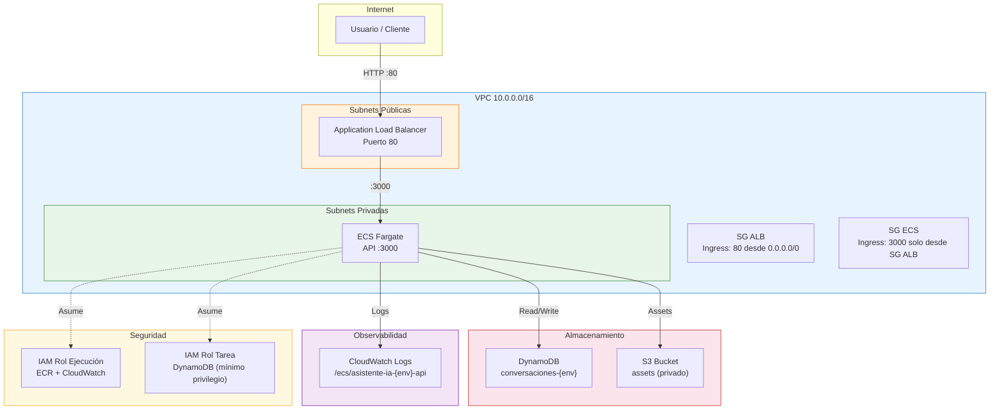
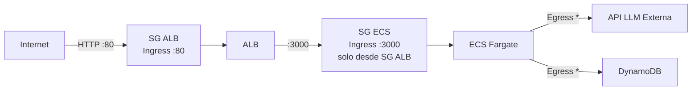
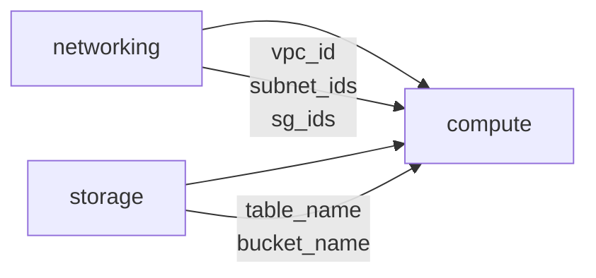

# iac-infra — Infraestructura como Código para Asistente IA

Infraestructura AWS desplegable tanto en **LocalStack** (desarrollo local) como en **AWS real** (dev/prod), usando un único codebase de Terraform.

## Estructura del proyecto

```
iac-infra/
├── .mcp.json                          # MCPs para Claude Code: Terraform, AWS Docs, LocalStack
├── .claude/skills/iac/SKILL.md        # Skill de IaC (steering file por defecto del programa)
├── docker-compose.yml                 # LocalStack Pro (emulador AWS local)
├── package.json                       # Scripts npm para ciclo de vida Terraform
├── infra/
│   ├── provider.tf                    # Provider AWS dual (LocalStack / AWS real)
│   ├── main.tf                        # Orquestación de módulos
│   ├── variables.tf                   # Variables raíz
│   ├── outputs.tf                     # Outputs raíz
│   ├── providers-local.tfvars         # Variables para LocalStack
│   ├── providers-aws.tfvars           # Variables para AWS real
│   ├── keys/                          # Llave SSH del bastion (gitignoreada, se genera)
│   └── modules/
│       ├── networking/                # VPC, subnets, IGW, NAT, VPC endpoints, SGs
│       │   ├── main.tf
│       │   ├── variables.tf
│       │   └── outputs.tf
│       ├── compute/                   # ECS Fargate, ALB, IAM, CloudWatch, Secrets Manager, EC2 bastion
│       │   ├── main.tf
│       │   ├── secrets.tf
│       │   ├── ec2.tf
│       │   ├── variables.tf
│       │   └── outputs.tf
│       └── storage/                   # DynamoDB, S3
│           ├── main.tf
│           ├── variables.tf
│           └── outputs.tf
├── scripts/
│   └── validate.sh                    # Validación de infraestructura y drift
└── specs/
    └── architecture.md                # Especificación arquitectónica
```

## Diagrama de arquitectura



## Flujo de red



## Diagrama de dependencias entre módulos



## Prerrequisitos

- **Terraform** >= 1.5
- **Docker** (para LocalStack)
- **AWS CLI** / **awslocal** (para validación)
- **Node.js** (para scripts npm)
- **LocalStack Pro** + `LOCALSTACK_AUTH_TOKEN` — la infra usa ECS, EC2, ELB, NAT y
  Secrets Manager, que son features de la edición Pro. Con la imagen community el apply
  falla en el primer paso (STS). El `docker-compose.yml` ya usa la imagen Pro.

## Setup inicial (primera vez)

### 1. Generar la llave SSH del bastion

El módulo `compute` registra un `aws_key_pair` leyendo la llave **pública** desde
`infra/keys/asistente-ia-dev.pub` (vía `file()` en `infra/main.tf`). Las llaves están
**gitignoreadas** (nunca se versionan), así que tras clonar hay que generarlas una vez:

```bash
ssh-keygen -t ed25519 -f infra/keys/asistente-ia-dev -N "" -C "asistente-ia-dev-bastion"
# Crea infra/keys/asistente-ia-dev (privada) y asistente-ia-dev.pub (pública)
```

- La **pública** (`.pub`) la lee Terraform para registrar el key pair en AWS/LocalStack.
- La **privada** es solo tuya; con ella te conectas al bastion:
  `ssh -i infra/keys/asistente-ia-dev ec2-user@<ec2_dev_public_ip>`.
- Sin este paso, `terraform plan`/`apply` falla con *"no such file or directory"* al leer el `.pub`.

### 2. Exportar el token de LocalStack Pro

```bash
export LOCALSTACK_AUTH_TOKEN=<tu-token>   # persistir en ~/.bashrc si lo usas seguido
```

## Coding agent: Claude Code

| Archivo | Qué hace |
|---------|----------|
| `.mcp.json` | Registra los tres MCPs de infraestructura. **Terraform MCP** (schemas reales del provider), **AWS Documentation MCP** (docs y límites) y **LocalStack MCP** (gestionar el emulador desde el chat). Claude Code los levanta al abrir el repo. |
| `.claude/skills/iac/SKILL.md` | **Skill de IaC**: naming, tags, seguridad, un código para dos destinos y cómo trabaja el agente. Claude Code lo carga automáticamente. |

Para tu propio proyecto: copia ambos archivos y ajusta el skill a tu producto.

## Comandos del ciclo de vida

Usa los scripts npm. Cada destino tiene su propio **workspace de Terraform** (`local` y `aws`) y por lo tanto su propio state: el apply en AWS nunca reutiliza los IDs creados en LocalStack.

```bash
docker compose up -d          # 1. LocalStack Pro (requiere LOCALSTACK_AUTH_TOKEN exportado)
npm run infra:init            # 2. terraform init (una vez)

npm run infra:plan:local      # 3. plan contra LocalStack
npm run infra:apply:local     # 4. apply en LocalStack (~90 s, 40 recursos)
npm run validate              # 5. recursos + seguridad + drift
npm run infra:output:local    #    URL del ALB, cluster, tabla, bucket…

npm run infra:plan:aws        # 6. provider swap: mismo código, otro .tfvars y otro workspace
npm run infra:apply:aws       # 7. apply en AWS real (pide confirmación)
npm run validate:aws
npm run infra:destroy:aws     # 8. ¡al terminar! NAT, ALB, Fargate y EC2 cobran por hora

npm run infra:destroy:local
```

### Qué verifica `npm run validate`

Descubre los recursos por sus tags y comprueba: VPC, 4 subnets, NAT Gateway, SG de ECS cerrado a internet, cluster y servicio ECS, ALB, secreto del LLM, tabla DynamoDB, bucket S3 privado y **drift** con `terraform plan -detailed-exitcode`.

> **Límite de LocalStack.** Después de un apply, `terraform plan` en LocalStack siempre muestra 2–3 cambios in-place en el listener del ALB, el ECS service y el bastion: el emulador no guarda esos atributos. `validate.sh` los reconoce y solo en modo local no los cuenta como drift. En AWS real, cualquier cambio es drift.

### Demo de drift

```bash
# Alguien "arregla" algo a mano en la consola: abre el SG de ECS a internet
SG=$(awslocal ec2 describe-security-groups --filters Name=group-name,Values=asistente-ia-local-sg-ecs --query 'SecurityGroups[0].GroupId' --output text)
awslocal ec2 authorize-security-group-ingress --group-id $SG --protocol tcp --port 22 --cidr 0.0.0.0/0
npm run validate           # ❌ SG abierto + ❌ drift en module.networking.aws_security_group.ecs
npm run infra:apply:local  # Terraform devuelve la infra al estado declarado
npm run validate           # ✅
```

### Imagen del contenedor

`imagen_contenedor` apunta por defecto a un **nginx de relleno** que escucha en el puerto 80. El target group y el health check esperan el **3000** con `/health`, así que la infraestructura se crea completa pero la URL del ALB responde error hasta que despliegues la imagen real del producto (escuchando en `:3000` con `GET /health`).

## Variables de configuración

| Variable | Default | Descripción |
|----------|---------|-------------|
| `proyecto` | `asistente-ia` | Nombre del proyecto (prefijo de recursos) |
| `environment` | `dev` | Entorno: `local`, `dev`, `prod` |
| `aws_region` | `us-east-1` | Región AWS |
| `localstack_endpoint` | `""` | Endpoint LocalStack (`http://localhost:4566`) |
| `imagen_contenedor` | — | URI de la imagen ECR |
| `tareas_deseadas` | `2` | Número de tareas ECS |

### Diferencias por entorno

| Configuración | LocalStack | AWS real |
|---------------|-----------|----------|
| `localstack_endpoint` | `http://localhost:4566` | `""` (vacío) |
| `aws_access_key` | `test` | `""` (usa perfil CLI) |
| `aws_secret_key` | `test` | `""` (usa perfil CLI) |
| `environment` | `local` | `dev` / `prod` |
| `tareas_deseadas` | `1` | `2` |

## Operaciones comunes

> Estos comandos de Terraform van dentro de `infra/` y con el workspace correcto seleccionado: `terraform workspace select local` o `aws`.

### Importar un recurso existente al state

```bash
terraform import -var-file=providers-local.tfvars \
  module.storage.aws_dynamodb_table.conversaciones conversaciones-local
```

### Refrescar state sin aplicar cambios

```bash
terraform refresh -var-file=providers-local.tfvars
```

### Formatear y validar código HCL

```bash
terraform fmt -recursive    # Formatear archivos .tf
terraform validate          # Validar sintaxis y configuración
```

### Listar y consultar recursos en el state

```bash
terraform state list                     # Listar todos los recursos
terraform state show module.storage.aws_dynamodb_table.conversaciones  # Detalle
```

### Mover un recurso en el state (refactor)

```bash
terraform state mv module.old_name.aws_resource.name module.new_name.aws_resource.name
```

## Convenciones

- **Naming:** `{proyecto}-{environment}-{componente}` (ej: `asistente-ia-local-vpc`)
- **Tags obligatorios:** `Proyecto`, `Environment`, `ManagedBy=terraform`
- **Seguridad:** mínimo privilegio en IAM, ECS sin IP pública, S3 con Block Public Access
- **Idioma:** recursos y variables en español
