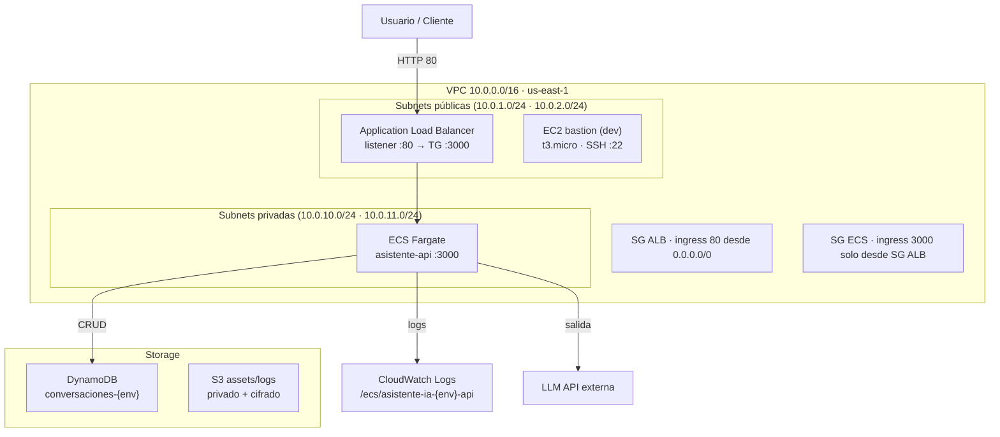

# Arquitectura del Asistente IA — Infraestructura en AWS

> **Propósito de este documento.** Es el **contrato de arquitectura** a partir del cual se genera
> toda la infraestructura Terraform del producto. El coding agent lo lee (junto con el skill
> `.claude/skills/iac/SKILL.md`) y, consultando el **Terraform MCP** para los schemas reales del provider,
> produce los módulos completos. Describe **qué** debe existir y con **qué propiedades** — no el HCL
> exacto; ese lo resuelve el agente contra el schema del provider `hashicorp/aws ~> 5.0`.

---

## 1. Descripción del sistema

API REST de un asistente conversacional con IA. Los usuarios envían mensajes por HTTP y reciben
respuestas generadas por un LLM. El historial de conversación se persiste por sesión en DynamoDB.
La aplicación corre en contenedores gestionados por **ECS Fargate** detrás de un **Application Load
Balancer**, en una red con separación pública/privada. Todo el codebase de Terraform despliega de
forma idéntica en **LocalStack** (desarrollo local, sin costo) y en **AWS real** (dev/prod),
cambiando solo un archivo de variables.

---

## 2. Diagrama de arquitectura

---

## 3. Módulos y orden de construcción

La infraestructura se organiza en tres módulos Terraform bajo `infra/modules/`, orquestados desde
`infra/main.tf`. **El orden importa** porque `compute` depende de outputs de los otros dos:

| Orden | Módulo | Responsabilidad | Depende de |
|-------|--------|-----------------|------------|
| 1 | `networking` | VPC, subnets, IGW, route tables, security groups | — |
| 2 | `storage` | DynamoDB, S3 | — (usa `account_id` del provider) |
| 3 | `compute` | IAM, CloudWatch, ECS (cluster/task/service), ALB, EC2 bastion | `networking` + `storage` |

**Cableado entre módulos** (lo que `main.tf` pasa a `compute`):
`vpc_id`, `ids_subnets_publicas`, `ids_subnets_privadas`, `id_security_group_alb`,
`id_security_group_ecs` (desde `networking`) y `nombre_tabla_dynamodb` + `arn_tabla_dynamodb` (desde `storage`).
El `account_id` se obtiene de `data.aws_caller_identity` y se pasa a `storage`.

---

## 4. Componentes detallados

### 4.1 Networking

- **VPC:** CIDR `10.0.0.0/16`, `enable_dns_support` y `enable_dns_hostnames` en `true`.
- **Subnets públicas (ALB + bastion):** `10.0.1.0/24` (us-east-1a) y `10.0.2.0/24` (us-east-1b), con
  `map_public_ip_on_launch = true`.
- **Subnets privadas (tareas ECS):** `10.0.10.0/24` (us-east-1a) y `10.0.11.0/24` (us-east-1b), sin IP pública.
- **Internet Gateway:** entrada de tráfico de internet a las subnets públicas.
- **Route table pública:** ruta `0.0.0.0/0 → IGW`, asociada a las dos subnets públicas.
- **NAT Gateway + Elastic IP:** en la primera subnet pública. **Well-Architected (REL):** las tareas Fargate
  en subnets privadas necesitan esta salida para hacer *pull* de la imagen en ECR y **llamar al LLM externo**
  por internet. Sin NAT (ni VPC endpoints), en AWS real las tareas no arrancan. Uno solo para dev; en prod
  de alta disponibilidad, uno por AZ.
- **Route table privada:** ruta `0.0.0.0/0 → NAT Gateway`, asociada a las dos subnets privadas.
- **Gateway endpoints (S3 y DynamoDB):** gratis, asociados a la route table privada. **WA (COST/SEC):**
  mantienen ese tráfico dentro de la red de AWS, sin pasar por el NAT ni por internet.
- **Security Group ALB:** ingress TCP `80` desde `0.0.0.0/0`; egress `all`.
- **Security Group ECS:** ingress TCP `3000` **solo desde el SG del ALB** (referencia por `security_groups`,
  no por CIDR); egress `all` (las tareas llaman al LLM externo).

Los CIDRs, AZs y listas de subnets deben ser **variables con default** (ver §6) para que el módulo sea reutilizable.

### 4.2 Storage

- **DynamoDB `conversaciones-{env}`:**
  - Partition key `conversacion_id` (String), sort key `timestamp` (Number).
  - `billing_mode = PAY_PER_REQUEST`.
  - **TTL** habilitado sobre el atributo `expires_at`. La aplicación escribe `expires_at = now + N días`
    (N configurable, default **30**). DynamoDB elimina los ítems expirados automáticamente.
  - **Point-in-time recovery**: habilitado **solo en `prod`** (`enabled = environment == "prod"`).
- **S3 `asistente-ia-{env}-assets-{account_id}`** (el `account_id` en el nombre garantiza unicidad global):
  - **Versioning** habilitado.
  - **Block Public Access**: los cuatro flags en `true` (`block_public_acls`, `block_public_policy`,
    `ignore_public_acls`, `restrict_public_buckets`).
  - **Server-side encryption** por defecto con `AES256`.
  - Uso: assets de la app y logs.

### 4.3 Compute — ECS Fargate + ALB

- **IAM · Rol de ejecución de la tarea** (`ecs-tasks.amazonaws.com`): política gestionada
  `AmazonECSTaskExecutionRolePolicy` (pull de imagen en ECR + escribir en CloudWatch Logs) **+ política inline
  `secretsmanager:GetSecretValue` restringida al ARN del secreto del LLM** (para inyectarlo en el arranque).
- **IAM · Rol de la tarea** (`ecs-tasks.amazonaws.com`): política **inline** con acceso DynamoDB
  (`GetItem`, `PutItem`, `UpdateItem`, `DeleteItem`, `Query`, `Scan`) **restringida al ARN de la tabla de
  este entorno** — nunca `Resource = "*"`. Son **dos roles distintos**: ejecución (infra) vs. tarea (app).
- **CloudWatch Log Group:** `/ecs/asistente-ia-{env}-api`, `retention_in_days = 30`.
- **ECS Cluster:** `asistente-ia-{env}-cluster`, con **Container Insights `enhanced`** (WA · OPS: telemetría
  del cluster hasta nivel de contenedor).
- **ECS Task Definition** (`asistente-api`):
  - `requires_compatibilities = ["FARGATE"]`, `network_mode = "awsvpc"`.
  - CPU `512`, memoria `1024` (variables con default).
  - Contenedor puerto `3000`; variables de entorno **no sensibles** `PORT=3000`, `AWS_REGION`, `DYNAMODB_TABLE`.
  - **Secreto del LLM inyectado vía `secrets` (`valueFrom` = ARN de Secrets Manager)** — nunca en claro.
  - Health check del contenedor: `curl -f http://localhost:3000/health`.
  - Logs vía driver `awslogs` apuntando al log group anterior.
- **Application Load Balancer:** `application`, `internal = false`, en las **subnets públicas**, con el SG del ALB.
- **Target Group `-tg-api`:** puerto `3000`, protocolo HTTP, `target_type = "ip"` (requerido por Fargate awsvpc),
  health check en path `/health`.
- **Listener HTTP:** puerto `80`, acción `forward` al target group.
- **ECS Service:** `launch_type = FARGATE`, `desired_count` = variable, en **subnets privadas**, con el SG de ECS,
  `assign_public_ip = false`, bloque `load_balancer` apuntando al target group (container `asistente-api`, puerto 3000),
  `lifecycle { ignore_changes = [desired_count] }` (no revertir escalado manual) y `depends_on` del listener.
  - **WA · REL:** `deployment_circuit_breaker { enable = true, rollback = true }` (rollback automático si un deploy
    no alcanza estado estable) y `health_check_grace_period_seconds = 60`.

### 4.3.1 Secrets Manager — API key del LLM

- **`aws_secretsmanager_secret` `asistente-ia-{env}-llm-api-key`** + una versión con valor **placeholder**.
- El `secret_string` real lo pone el equipo de la app **fuera de Terraform**; el recurso usa
  `lifecycle { ignore_changes = [secret_string] }` para que el valor real **nunca viva en el state ni en el código**.
- El rol de **ejecución** de ECS lo lee (`GetSecretValue`, scoped a este ARN) y la task definition lo inyecta como
  variable `LLM_API_KEY`.

### 4.4 Compute — EC2 bastion (dev)

Instancia de desarrollo para acceso SSH e inspección. Vive en el módulo `compute` (`ec2.tf`).

- **AMI:** `data "aws_ami"` — Amazon Linux 2023 más reciente (`al2023-ami-*-x86_64`, `state = available`,
  owner `amazon`). Funciona en AWS real y en LocalStack (que devuelve AMIs sintéticas).
- **Key pair:** registra la llave pública desde `infra/keys/asistente-ia-dev.pub` (variable de ruta).
- **Security Group SSH:** ingress TCP `22` desde `ssh_allowed_cidr` (variable; en LocalStack `0.0.0.0/0` es
  aceptable, en AWS real restringir a la IP propia); egress `all`.
- **Instancia:** `t3.micro` (variable), en la **primera subnet pública**, con IP pública asociada.
  - **IMDSv2 obligatorio:** `http_tokens = "required"` (bloquea SSRF que leería credenciales de la instancia).
  - **Root volume:** `gp3`, 8 GB, `encrypted = true`, `delete_on_termination = true`.
  - `user_data`: `dnf update -y` + marcador en `/etc/motd`.
- **Nota de alcance:** el bastion es una conveniencia de desarrollo. En `prod` puede omitirse o
  restringirse por `ssh_allowed_cidr`; no es parte del camino de tráfico del producto.

---

## 5. Estrategia de providers — un solo código, dos destinos

Un **único** `provider "aws"` (en `infra/provider.tf`) sirve para LocalStack y AWS real. El interruptor
es la variable `localstack_endpoint`:

- **Vacía (`""`) → AWS real:** el provider usa el perfil de AWS CLI y los endpoints por defecto.
- **Con valor (`http://localhost:4566`) → LocalStack:** se activan `skip_credentials_validation`,
  `skip_requesting_account_id`, `skip_metadata_api_check` y `s3_use_path_style`, y el bloque `endpoints`
  redirige cada servicio al emulador.
- Servicios a redirigir en el bloque `endpoints`: `s3, dynamodb, ecs, ecr, iam, logs, elbv2, ec2, sts, cloudwatch, secretsmanager`.
- `data "aws_caller_identity"` da el `account_id` real en AWS y `000000000000` en LocalStack.

El swap entre entornos es **solo un `-var-file`** distinto (ver §9), cada uno en su **workspace** de Terraform (`local` / `aws`) para que no compartan state. El código de los módulos es idéntico.

---

## 6. Contrato de variables de entrada (raíz)

| Variable | Tipo | Default | Nota |
|----------|------|---------|------|
| `proyecto` | string | `asistente-ia` | Prefijo de naming de todos los recursos |
| `environment` | string | `dev` | `local` · `dev` · `prod` |
| `aws_region` | string | `us-east-1` | |
| `localstack_endpoint` | string | `""` | Interruptor LocalStack/AWS (§5) |
| `aws_access_key` | string (sensitive) | `""` | `test` en LocalStack; vacío en AWS (usa perfil CLI) |
| `aws_secret_key` | string (sensitive) | `""` | idem |
| `imagen_contenedor` | string | placeholder ECR | URI de la imagen del API |
| `tareas_deseadas` | number | `2` | Réplicas ECS (1 en local) |
| `ssh_public_key_path` | string | `keys/asistente-ia-dev.pub` | Relativa a `infra/` |
| `ssh_allowed_cidr` | string | `0.0.0.0/0` | Restringir en AWS real |
| `ec2_instance_type` | string | `t3.micro` | Bastion |

Variables internas de módulo con default: CIDRs y AZs (networking), `cpu_tarea=512`/`memoria_tarea=1024`
(compute), `ttl_conversaciones_dias=30` (storage).

---

## 7. Outputs esperados (raíz)

El agente debe exponer, desde `infra/outputs.tf`, al menos:

- `url_api` — `http://{dns del ALB}` (endpoint base para probar el producto).
- `nombre_cluster_ecs` — para desplegar nuevas versiones de la imagen.
- `nombre_tabla_conversaciones` — para verificar persistencia.
- `nombre_bucket_assets` — bucket S3.
- `logs_del_api` — nombre del log group de CloudWatch.
- `arn_secreto_llm` — ARN del secreto de Secrets Manager (el equipo de la app le pone el valor real).
- `ec2_dev_public_ip`, `ec2_dev_key_name`, `ec2_dev_ssh_command` — acceso al bastion.

---

## 8. Restricciones de seguridad (obligatorias)

Alineadas con `.claude/skills/iac/SKILL.md` — el agente **debe** cumplirlas:

1. **Mínimo privilegio IAM:** la política DynamoDB del rol de tarea apunta al **ARN exacto** de la tabla
   del entorno, nunca `"*"`.
2. **ECS sin IP pública directa:** las tareas van en subnets privadas; solo el ALB recibe tráfico de internet.
3. **SG de ECS cerrado:** ingress `3000` solo desde el SG del ALB, no desde `0.0.0.0/0`.
4. **S3 privado siempre:** los cuatro flags de Block Public Access en `true`, y cifrado por defecto (AES256).
5. **Secretos fuera del contenedor:** la API key del LLM vive en **AWS Secrets Manager** y se inyecta vía
   `secrets`/`valueFrom`, nunca como variable de entorno en claro. Como variables solo van `PORT`, `AWS_REGION`, `DYNAMODB_TABLE`.
6. **Sin hardcoding de account IDs ni ARNs de otras cuentas:** usar `data.aws_caller_identity.actual.account_id`.
7. **IMDSv2 obligatorio** en la instancia EC2 (`http_tokens = "required"`).
8. **Cifrado en tránsito (prod):** en producción, añadir listener HTTPS `:443` con certificado **ACM** y redirigir
   `80 → 443`. Se omite en la demo porque requiere un dominio; queda documentado como paso de hardening de prod.

---

## 9. Entornos y despliegue

| Entorno | Provider | Comando |
|---------|----------|---------|
| `local` | LocalStack en Docker | `terraform apply -var-file=providers-local.tfvars` |
| `dev` | AWS real, cuenta dev | `terraform apply -var-file=providers-aws.tfvars` |
| `prod` | AWS real + state remoto | `providers-aws.tfvars` con `environment=prod` (habilita PITR en DynamoDB) |

Los `.tfvars` solo difieren en `localstack_endpoint`, `aws_access_key`, `aws_secret_key`, `environment`
y `tareas_deseadas`. Es el **"cambian 4 líneas"** de la clase — son **variables**, no archivos de provider distintos.

> **Requisito de LocalStack:** ECS, ELBv2 y EC2 se emulan en **LocalStack Pro**. Con la edición community,
> S3/DynamoDB/IAM/Logs funcionan pero ECS/ALB/EC2 no se crean. La demo asume LocalStack Pro.

---

## 10. Guía de generación para el coding agent

Cuando se reconstruye `infra/` desde cero a partir de este documento:

1. **Leer primero** este `architecture.md` completo y el skill `.claude/skills/iac/SKILL.md` (naming, tagging, seguridad).
2. **Consultar el Terraform MCP Server** para el schema real de cada recurso antes de escribirlo
   (`aws_vpc`, `aws_ecs_task_definition`, `aws_lb_target_group`, `aws_instance`, …). No asumir atributos de memoria.
3. **Generar en orden:** `provider.tf` + `variables.tf` → módulo `networking` → módulo `storage` →
   módulo `compute` (incluye `ec2.tf`) → `main.tf` (cableado) → `outputs.tf` → `providers-*.tfvars`.
4. **Aplicar convenciones del steering:** `nombre_base = "${var.proyecto}-${var.environment}"` vía `locals`,
   los tres tags obligatorios (`Proyecto`, `Environment`, `ManagedBy`) en cada recurso, descripciones en español.
5. **Antes de `apply`, correr `plan`** y revisar el diff con el grupo — el plan es parte del relato de la demo.

### Definición de "terminado" (acceptance criteria)

- [ ] `terraform validate` pasa y `terraform plan -var-file=providers-local.tfvars` no muestra errores.
- [ ] `terraform apply` contra LocalStack crea VPC, 4 subnets, IGW, **NAT Gateway + EIP**, 2 route tables,
      **gateway endpoints S3 + DynamoDB**, 3 security groups, DynamoDB, S3 (con versioning + PAB + cifrado),
      2 roles IAM, **Secrets Manager**, log group, cluster ECS **con Container Insights**, task/service ECS
      **con circuit breaker**, ALB + target group + listener, y la instancia EC2 bastion.
- [ ] `scripts/validate.sh` (vía `npm run validate`) encuentra los recursos por sus tags y no reporta fallos.
- [ ] `terraform plan` repetido sobre la infra ya aplicada devuelve **"No changes"** en AWS real. En LocalStack quedan 2–3 diferencias conocidas del emulador, que `validate.sh` distingue del drift real.
- [ ] Ninguna política IAM usa `Resource = "*"`; el bucket S3 no es público; el SG de ECS no abre `0.0.0.0/0`.
